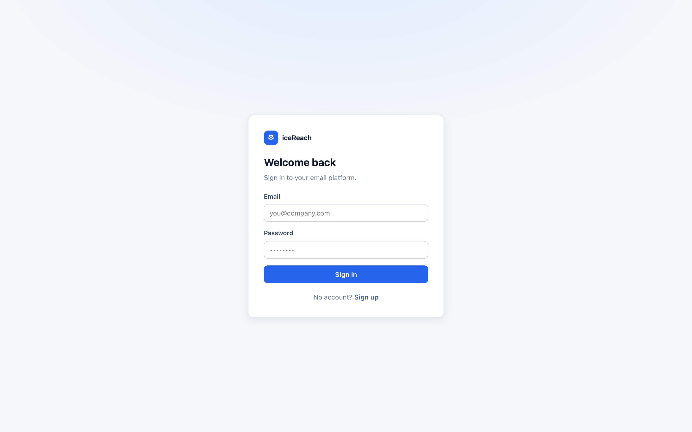
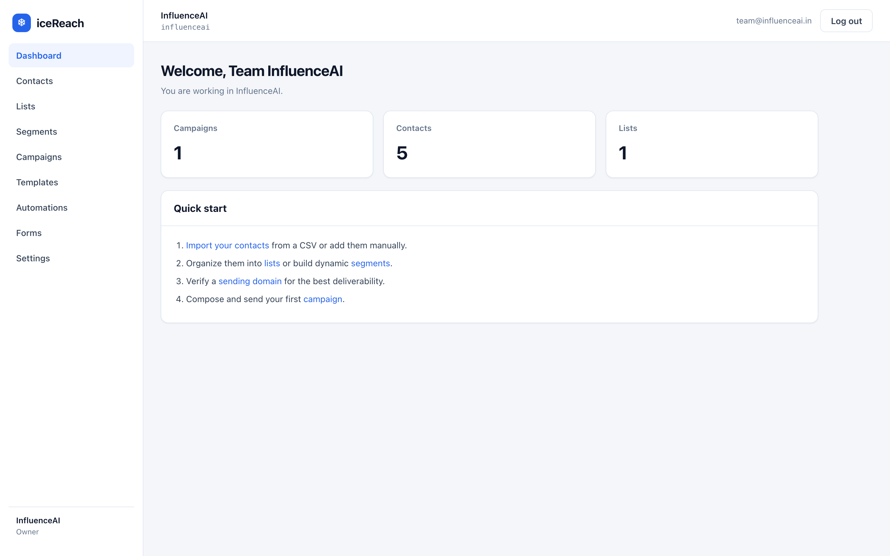
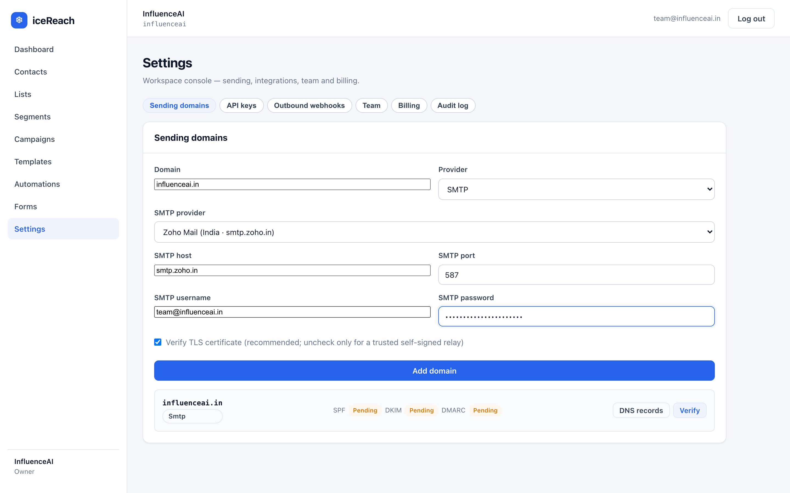
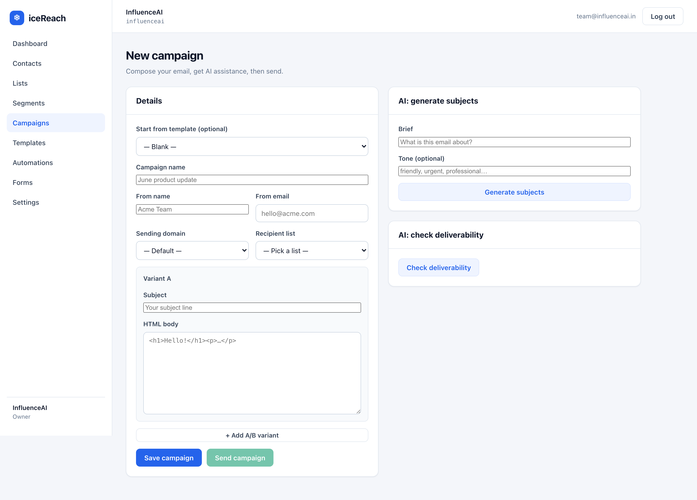

# iceReach — UI Walkthrough (with screenshots)

A click-by-click tour of the web app, end to end, using a **Zoho** sender
(`smtp.zoho.in:587`, `team@influenceai.in`). This is the visual companion to
[END-TO-END-GUIDE.md](END-TO-END-GUIDE.md) (which covers install, `.env`, and the API).

> **About the screenshots.** The images below live in `docs/ui/`. If a picture isn't
> showing, drop the matching capture there with the given filename — each caption
> describes exactly what the screen looks like, so the guide reads fine either way.
> (All shots are the real app running locally.)

---

## 0. Start the app

```bash
cp .env.example .env          # set SECRET_KEY; add GEMINI_API_KEY for the AI features
cd frontend && npm run build && cd ..
python run.py                                   # terminal 1 — opens the browser
PYTHONPATH=backend python -m icereach.services.queue   # terminal 2 — the worker
```

The worker is required for sends/imports/automations to actually run. Open the URL
`run.py` prints (e.g. `http://127.0.0.1:8000`).

---

## 1. Create your account


> 📸 *The iceReach card with **Email** + **Password** and a **Sign in** button. Click
> **“Sign up”** at the bottom to switch to create-account mode (adds **Your name** +
> **Workspace name** fields).*

1. Click **Sign up**.
2. Fill **Your name** (e.g. `Team InfluenceAI`), **Workspace name** (`InfluenceAI`),
   **Email** (`team@influenceai.in`), **Password**.
3. Click **Create workspace** → you're signed in as the workspace **owner**.

---

## 2. The dashboard & navigation


> 📸 *Left sidebar: **Dashboard, Contacts, Lists, Segments, Campaigns, Templates,
> Automations, Forms, Settings**. Header shows the workspace name + **Log out**.
> Cards show Campaigns/Contacts/Lists counts (all 0 at first) and a **Quick start** list.*

Everything is reached from the left sidebar. Follow the **Quick start** order: contacts →
lists → sending domain → campaign.

---

## 3. Add your Zoho sending domain (do this first)

Go to **Settings**. You'll see tabs: **Sending domains · API keys · Outbound webhooks ·
Team · Billing · Audit log**. On **Sending domains**:


> 📸 *The **Sending domains** form: **Domain** = `influenceai.in`; **Provider** = `SMTP`;
> **SMTP provider** dropdown set to **“Zoho Mail (India · smtp.zoho.in)”**; **SMTP host**
> `smtp.zoho.in`; **SMTP port** `587`; **SMTP username** `team@influenceai.in`; **SMTP
> password** (your Zoho **app password**); a checked **“Verify TLS certificate”** box; and
> an **Add domain** button.*

1. **Domain:** `influenceai.in`
2. **Provider:** `SMTP`
3. **SMTP provider:** pick **Zoho Mail (India · smtp.zoho.in)** — this auto-fills host
   `smtp.zoho.in` and port `587`. (Other providers are in the dropdown too; choose
   **Custom / other…** to type any server.)
4. **SMTP username:** `team@influenceai.in`
5. **SMTP password:** your Zoho **App Password** (Zoho Mail → Settings → Security → App
   Passwords — *not* your login password).
6. Leave **Verify TLS certificate** checked.
7. **Add domain.**

> The form also shows DNS records for iceReach's own DKIM — **with Zoho you can ignore
> them**; rely on the SPF/DKIM/DMARC you set up in the Zoho admin. From addresses must be
> `team@influenceai.in` (or a verified alias).

---

## 4. Add contacts

**Contacts → Add contact** (email + optional name + custom attributes), or **Import** a
CSV/Excel. The import runs as a background job with a live progress bar; invalid and
already-suppressed addresses are skipped. A CSV needs an `email` column (plus `name` and
any custom columns you want as `{merge}` tags).

> 📸 *`docs/ui/04-contacts.png` — the Contacts table with an **Add contact** form and an
> **Import** control.*

---

## 5. Lists & segments

- **Lists** (static): create a list, then add contacts to it.
- **Segments** (dynamic): **Segments → New** → add rule rows (field / op / value) combined
  with **all** / **any**; **Preview** shows the matching count + sample. Fields:
  `email, name, status, attributes.<key>`; ops: `eq, neq, contains, gt, lt, in, exists`.

> 📸 *`docs/ui/05-segments.png` — the segment rule builder with a preview count.*

---

## 6. Build a template (drag-and-drop)

**Templates → New** opens the block builder.

- Left: a **palette** of blocks (heading, text, button, image, divider, spacer, 2-column).
- Middle: your blocks — reorder (drag / up-down), edit each block's fields, duplicate, delete.
- Right: a **live preview** that is exactly what gets sent.
- Use `{name}` (or any contact attribute) anywhere to personalize.
- **Save**, then **Send test** (pick the Zoho domain + your address) to see it in your inbox.

> 📸 *`docs/ui/06-template-builder.png` — palette + block list + live iframe preview.*

---

## 7. Create & send a campaign

**Campaigns → New campaign:**


> 📸 *The **New campaign** form: **Start from template (optional)**, **Campaign name**,
> **From name**, **From email**, **Sending domain**, **Recipient list**, and a **Variant A**
> block with **Subject** + **HTML body**. Below the fold: **AI** buttons (generate subjects,
> check deliverability), **+ Add A/B variant**, and **Save / Send**.*

1. **Campaign name**, **From name** (`InfluenceAI`), **From email** = `team@influenceai.in`.
2. **Sending domain** = your Zoho domain; **Recipient list** = a list you created.
3. Write the **Subject** + **HTML body**, or **Start from template**.
4. **AI** (needs `GEMINI_API_KEY`): *Generate subjects* → pick one; *Check deliverability* →
   spam-risk + fixes before sending.
5. **A/B test:** **+ Add A/B variant** to add a second subject/body with a weight; recipients
   are split by weight.
6. **Save**, then **Send** → a job runs; watch the progress bar to completion.

> Open/click/unsubscribe links use `BASE_URL`. On localhost only you can open them; for real
> recipients set `BASE_URL` to a public URL before sending.

---

## 8. Track results

Open a sent campaign → **Analytics**: **sent, opens (unique/total), clicks, CTR/CTOR,
unsubscribes, bounces**. The **A/B** table shows per-variant rates + the winner. Click
**Generate AI summary** for a plain-language narrative.

> `delivered` and `complaints` show **“—”** on Zoho SMTP (they aren't truthfully knowable
> over SMTP); they light up only with an ESP (Resend/SendGrid) + its webhook.

> 📸 *`docs/ui/08-analytics.png` — metric cards + A/B breakdown + AI summary.*

---

## 9. Automations (drip journeys)

**Automations → New:** choose a **trigger** (*Manual* or *List subscribe*), then add ordered
steps — **Send** (subject/HTML or a template), **Wait** (N days), **Condition** (segment
rule: continue if matched, else exit). Set the **sending domain** + **from email**. Use
**AI: draft sequence** to turn a goal into a ready journey. **Activate**, then **Enroll**
contacts (or let list-subscribe auto-enroll). **Runs** shows each contact's position/status.

> 📸 *`docs/ui/09-automation-builder.png` — trigger picker + ordered step cards + Activate.*

---

## 10. Signup forms

**Forms → New:** name, target **list**, **sending domain** (for the confirmation email),
**double opt-in** toggle. The page gives you a public URL `BASE_URL/f/{id}` to share/embed.
With double opt-in, subscribers confirm via email before joining. Your public newsletter
archive is at `BASE_URL/a/<workspace-slug>`.

> 📸 *`docs/ui/10-forms.png` — form list + create form + copyable public URL.*

---

## 11. The rest of Settings

- **API keys:** create a key (shown **once**) for the public `/v1` API — use it as
  `Authorization: Bearer ice_...`.
- **Outbound webhooks:** POST your URL on `open`/`click`/etc. events.
- **Team:** invite members (owner grants *admin*; admins add *members*).
- **Billing (preview):** pick a plan → sets your monthly **send quota** (scaffold; no real charge).
- **Audit log:** who did what (sends, member/billing changes).

> 📸 *`docs/ui/11-settings-tabs.png` — the API keys / Team / Billing / Audit tabs.*

---

## Troubleshooting (quick)

| Symptom | Fix |
|---|---|
| Send stuck "queued" | Start the **worker** (`python -m icereach.services.queue`). |
| Zoho auth fails | Use a Zoho **App Password**; username is the full `team@influenceai.in`. |
| "from not allowed" | **From email** must be `team@influenceai.in` (or a verified alias). |
| Links broken for recipients | Set a **public** `BASE_URL` and resend. |
| AI buttons → 503 | Add `GEMINI_API_KEY` to `.env` and restart. |

Full troubleshooting + the API/curl path are in [END-TO-END-GUIDE.md](END-TO-END-GUIDE.md).
